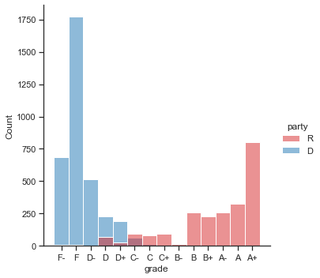
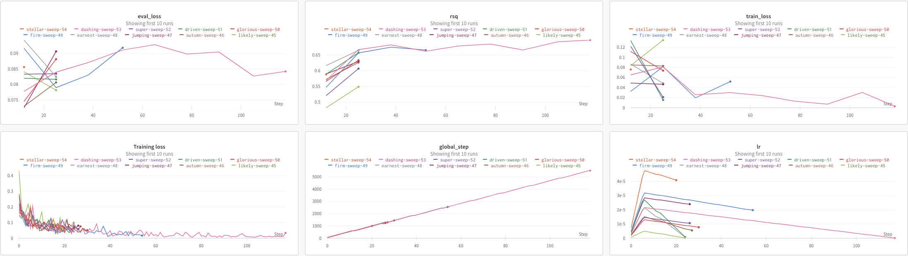
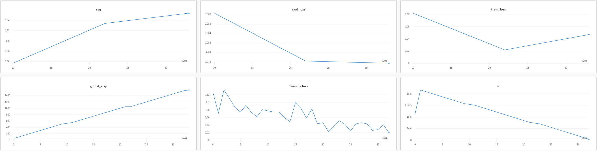
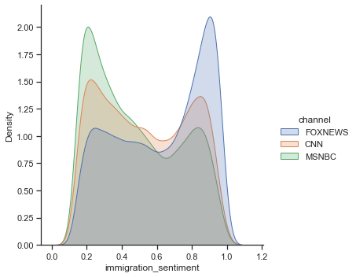

# Quantifiying Media Sentiment about Immigration

In this python notebook I explore quantifiying media sentiment about immigration on U.S. cable news. I use a very large corpus of cable news broadcasts (≈6 million 1-minute broadcasts) web scraped from the [TV Archive][1] and state-of-the-art Transformer models trained to recognize media sentiment about the topic of immigration. 

The ideas explored here are very similar to the slant method pioneered by Gentzkow and Shapiro (2010). The idea is to identify the kind of language that *both* anti-immigrant and pro-immigrant politicians use, and then to capture the use of this language in the media. For example (see Djourelova 2021), when discussing the topic of immigration to the U.S. via non-legal routes, politicians that are opposed to this tend to refer to these immigrants as "illegal immigrants", while politicians that tend to be more pro-immigrant tend to use the term "undocumented immigrants". Thus if a media outlet always uses the term "illegal immigrant" when discussing this topic, then it is probably a more anti-immigrant media outlet. 

I take this slant approach by training/fine-tuning the Transformer model BERT (Devlin et al. 2018) on speeches given by politicians in Congress about immigration. As the target label, I acquired the "grades" that an anti-immigrant think-tank, NumbersUSA[2], gives to politicians on Congress on their stance on immigration. Thus the model should learn to recognize the kind of language that identifies pro- and anti-immigrant sentiment. I then run this model on my corpus of cable news broadcasts about immigration, obtaining its sentiment predictions. I did this with the easy to use [Simple Transformers][3] python library. 

Let's get started!

[1]: https://archive.org/details/tv
[2]: https://www.numbersusa.com/content/my/tools/grades
[3]: https://simpletransformers.ai/


Install and load in necessary packages


```python
#!pip3 install pandas numpy seaborn wandb matplotlib

import pandas as pd
import numpy as np
import matplotlib.pyplot as plt
import seaborn as sns
import wandb
from pprint import pprint 

sns.set_theme(style="ticks")

%matplotlib inline

```

## Congressional Speeches and Immigration Grades

Now we want to load in the data that was used to train the BERT slant model. Because these datasets are very large, they are not available in this repo. If you'd like access to this data, send me an email!

The data consists of speeches about immigration given by politicians during the 111th-114th Congresses (2009-2016) paired with how an anti-immigration think-tank rates those politicians. The speeches come from Gentzkow, Shapiro and Taddy (2019), who collected the data from the Congressional Record. They cleaned and parsed the speeches, making them far easier to work with. The "immigration grades" come from NumbersUSA, an anti-immigration think-tank that lobbies Congress for lower levels of immigration to the U.S. They rate politicians on how anti-immigration they are, based on their voting record. These grades range from A+ to F-. Politicians that always vote for lower immigration levels to the U.S. receive a grade of A+, whereas politicians that consistently support an agenda to increase immigration levels to the U.S. will receive lower grades, like an F-. 


```python
# load in the data
immig_training_data = pd.read_csv(
    "raw-data/immigration_training_data.csv", 
    encoding="ISO-8859-1")
# keep only speeches from the 111th to the 114th congresses (overlaps with sample period)
immig_training_data = immig_training_data[immig_training_data["congress"] >= 111]
# convert text to lower case
immig_training_data["speech"] = immig_training_data["speech"].apply(lambda x: x.lower())
```

Below we can see that we have a lot of information to go along with the speeches, including who the speaker was, which Congress the speech was given in, what their position in Congress is, their party, etc. We also see the variable "grade", which is the grade that the politician giving the speech receives on their immigration position from NumbersUSA. 


```python
# get a selection of data for viewing
pprint(immig_training_data.sample(n=5, random_state=1))
```

          speakerid   speech_id   lastname firstname chamber state gender party  \
    3593  113121900  1130002950      PAYNE    DONALD       H    NJ      M     D   
    4735  112121450  1120125922      SMITH     LAMAR       H    TX      M     R   
    2237  113118920  1130125406  CICILLINE     DAVID       H    RI      M     D   
    4816  111114751  1110075138     ENSIGN      JOHN       S    NV      M     R   
    636   114119900  1140002833     ISRAEL     STEVE       H    NY      M     D   
    
          district nonvoting                                             speech  \
    3593      10.0    voting  let me first say "thank you" to the gentleman ...   
    4735      21.0    voting  mr. speaker. i move to suspend the rules and p...   
    2237       1.0    voting  mr. speaker. last night. the house rules commi...   
    4816       NaN    voting  mr. president. in a little while. i will be ma...   
    636        3.0    voting  madam speaker. this is the final amendment to ...   
    
          congress  speech_length  word_count  sentence_count  immigration_speech  \
    3593       113         2112.0         378              16                True   
    4735       112          245.0          39               2                True   
    2237       113         1222.0         200              10                True   
    4816       111        11597.0        1915             115                True   
    636        114         4456.0         753              43                True   
    
         grade  rating  grade_label  party_label  
    3593     F       9            2            0  
    4735    A+      96           14            1  
    2237     F      12            2            0  
    4816    C+      61            8            1  
    636      F      14            2            0  


```python
pprint(immig_training_data[immig_training_data.grade == "F-"].speech.sample(n=5, random_state=10))
```

    4942    i agree with my colleagues on the other side o...
    2535    mr. speaker. i have spent the past year speaki...
    2540    mr. speaker. i thank the gentleman from texas ...
    582     mr. speaker. when we got our first color tv. i...
    5466    i thank the gentleman. heres what id like to d...
    Name: speech, dtype: object


Here is an example of a speech from a politician who receives a grade of A+ from NumbersUSA, Represenative Lou Barletta: 


```python
pprint("Lou Barletta Immigration Grade: " + str(immig_training_data["grade"][4200]))
pprint(immig_training_data.speech[4200][0:968])
```

    'Lou Barletta Immigration Grade: A+'
    ('i wish i didnt have to stand here tonight in strong support of this '
     'amendment. but the simple fact is that the federal governments lack of '
     'action made us do this. the federal government. through its deliberate '
     'inaction for at least the last 15 years. has created this problem. the '
     'problem of unchecked illegal immigration. from the border states to the '
     'heartland. from our largest cities to our smallest boroughs. every american '
     'has seen the impact of illegal immigration. an underground workforce that '
     'takes away jobs from american citizens and our legal immigrants. overcrowded '
     'classrooms that make it harder for children to learn. health care systems '
     'forced to the brink of bankruptcy because of unreimbursed costs. victims of '
     'crimes committed by people who should not even be in the united states. '
     'local municipal leaders called out to the federal government and asked for '
     'help. i know because i was one of them. i saw serious problems in my '
     'hometown back in 2005.')


And here is an example of a speech given from a politician who receives an F- from NumbersUSA, Representative Joe Bacca:


```python
pprint("Joe Bacca Immigration Grade: " + str(immig_training_data["grade"][4942]))
pprint(immig_training_data.speech[4942][0:810])
```

    'Joe Bacca Immigration Grade: F-'
    ('i agree with my colleagues on the other side of the aisle that americas '
     'borders must be secured. border security is an important part of '
     'comprehensive reform. but we simply cannot ignore the 12 million individuals '
     'who are forced to live in the shadows of our society. our broken immigration '
     'system is tearing families apart. thousands of families. every year. the '
     'department of homeland security reports that over the last 10 years. more '
     'than 100.000 immigrant parents of u.s. citizen children have been deported. '
     'misguided laws like arizonas sb1070 dont help keep families together. '
     'immigration is a federal problem that can only be solved with a '
     'comprehensive approach that is both sensitive to families and ensures border '
     'security. i urge my colleagues. both democrats and republicans. to cosponsor '
     'h.r. 432')


Here I plot the distribution of immigration grades in Congress. As we can see, a politician's stance on immigration mostly follows partisanship, with Republicans typically being more anti-immigration and Democracts more pro-immigration. There is some cross-over variation however, especially with some Republicans taking a more moderately pro-immigrant stance. This is the source of variation that the model will attempt to learn to predict, given the words that politicians use in their speeches about immigration.


```python
# plot the distribution of ideology in congress
# order grades from F- to A+
immig_training_data["grade"] = pd.Categorical(
    immig_training_data["grade"],
    categories=["F-", "F", "D-", "D", "D+", "C-", "C", "C+", "B-", "B", "B+", "A-", "A", "A+"],
    ordered=True
)
party_palette = {"R": "tab:red", "D": "tab:blue"}
sns.displot(immig_training_data, x="grade", hue="party", fill=True, palette=party_palette)
plt.show()
```


    

    


## Bert Model Fine-Tuning 

Having illustrated the key sources of variation, we are now ready to fine-tune our BERT model to recognize sentiment about immigration in political speech. The "features" are the text of the speeches, and the target labels are the immigration grades. I convert the grades to numeric values and (min-max) normalize them to fall between 0 and 1 in order to speed up training. Because these grades vary continously, I train the model using a regression task (adding a final linear layer to the BERT model). To converge on a final model, I used WandB sweeps to tune the two most important hyperparameters of these models, the learning rate and the number of epochs. Because these models are very costly to train, I do not do this here. You can see the code for this in scripts/3-immig-sent-sweep.py. The results from training these models on powerful cloud computing systems with GPUs on the UZH science cloud platform are presented below from WandB:



After many runs of the model, I converged on a learning rate of about 2e-05 and 3 epochs of training as the optimal hyperparameters in this setting. I then trained a model with these hyperparameters in scripts/4-train-immig-sent.py. The results are presented below. As we can see, the model reaches an R-squared of about 0.65, meaning that given the text of speeches in the test set, the model can explain 65% of the variation in immigration grades. 



## Running the Fine-tuned Model on the Cable News Corpus

I then ran this model on my dataset of cable news broadcasts, restricted to cable news segments that contains a term related to immigration (at least one word that reduces to the stem word "immigr".). Given the words used in the cable news segments, the model yields predicted immigration grades for those segments. I load these results in, and merge them to some metadata so we can start to explore slant on the media. 


```python
# load in the cable news immigration scores as predicted from the BERT immigration sentiment model
media_immig_sentiment = pd.read_csv(
    "output-data/media-immig-sent-scores.csv", 
    usecols = ["id", "immigration_score"]
    )
media_immig_sentiment = media_immig_sentiment.rename(columns={"immigration_score": "immigration_sentiment"})


# load in some meta data for the cable news segments
tv_archive_data = pd.read_csv(
    "raw-data/tv-archive-data.csv", 
    usecols = ["id", "date", "channel"]
    )

# resolving some channel name issues
conditions = [
    tv_archive_data["channel"] == "FOXNEWSW",
    tv_archive_data["channel"] == "MSNBCW",
    tv_archive_data["channel"] == "CNNW"
]
choices = ["FOXNEWS", "MSNBC", "CNN"]
tv_archive_data["channel"] = np.select(conditions, choices)

# keep only cable news 
tv_archive_data = tv_archive_data[
    (tv_archive_data["channel"] == "FOXNEWS") | 
    (tv_archive_data["channel"] == "MSNBC") | 
    (tv_archive_data["channel"] == "CNN")
    ]
# merge the meta data in
media_immig_sentiment = media_immig_sentiment.merge(tv_archive_data, on="id", how="inner")
```

Here I plot the distribution of estimated immigration sentiment by channel among cable news segments that are about immigration. immigration_sentiment is the normalized form of the immigration grades, and varies from 0 to 1 where higher values indicate more anti-immigrant language. Because the channels differ in the extent to which they discuss immigration (Fox News discusses it the most), I normalize the distributions by channel to make them easier to compare visually.

What immediately stands out is that Fox News exhibits far more segments with anti-immigrant language and far fewer pro-immigrant segments, as measured by the trained BERT immigration sentiment model. Both CNN and MSNBC exhibit far more pro-immigrant segments, with MSNBC exhibiting the most pro-immigrant segments. 

What this means intuitively is that when discussing immigration, the model thinks that Fox News tends to use the type of language that anti-immigrant politicians in Congress use, while CNN and especially MSNBC tend to use the type of language that is associated with pro-immigrant politicians in Congress. 


```python
# plot the distribution of immigration sentiment by channel
sns.displot(media_immig_sentiment, x="immigration_sentiment", hue="channel", kind="kde", fill=True, common_norm=False)
plt.show()
```


    

    


# References 

Devlin, Jacob, Ming Wei Chang, Kenton Lee, and Kristina Toutavnova. 2018. “BERT: Pre-training of Deep Bidirectional Transformers for Language Understanding.” *arXiv*: 1810.04805.

Djourelova, Milena. 2021. “Media Persuasion through Slanted Language: Evidence from the Coverage of Immigration.” *Working Paper*.

Gentzkow, Matthew, and Jesse M. Shapiro. 2010. “What Drives Media Slant: Evidence from U.S. Daily Newspapers.” *Econometrica*, 78(1): 35-71.

Gentzkow, Matthew, Jesse M. Shapiro, and Matt Taddy. 2019. “Measuring Group Differences in High-Dimensional Choices: Method and Application to Congressional Speech.” *Econometrica*, 87(4): 1307-1340.
